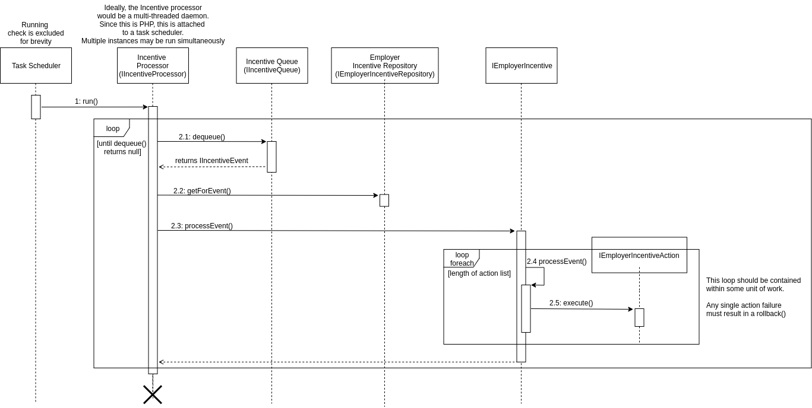

# Backend Engineering Exercise 

MIT License 


---


## Table of Contents 

1. [The Problem](#problem)
2. [Assumptions](#assumptions)
3. [Proposed Design](#proposed-design)
4. [Employer Incentive Dashboard](#employer-incentive-dashboard)
5. [Data Logging Endpoints](#data-logging-endpoints)
6. [Incentive Management Processing Queue](#incentive-management-processing-queue)
7. [Incentive Event Processor](#incentive-event-processor)
8. [Incentive Actions](#incentive-actions)
9. [Wiring](#wiring)

### Problem

Build an incentives system to reward eligible Enterprise users for engagement with the company's apps. 
Certain employers have employee engagement programs, and the company's incentives system needs to define 
a menu of events and event structures that employers can choose to reward through their programs. For 
example, an employer might incentivize logging health data (ex. Symptoms or moods) in the company's apps. If an 
eligible user logs such data five days in a row, they might receive a physical reward such as a pregnancy pillow. 
Your task is to design this system and then write code that establishes the pattern for implementation. The 
system you design should:  
 
1. Support different types of incentive events - for this exercise, you can assume there are two incentive events: 
    1. User logged data five days in a row 
    2. User reported a birth 
2. Identify and record when a user achieves a certain incentive 


### Assumptions 

1. An existing client-facing API contains endpoints for logging data and reporting birth
2. The existing client-facing API logging endpoints implement the visitor pattern, and can accept multiple visitors used to add extend event processing
3. API clients are authenticated and API logging endpoints have access to both an employer id and user id for the authenticated client
4. Some system and UI exists for creating incentives 
5. The employer's account dashboard has access to some incentive management dashboard used to incorporate/link incentives to employer programs


### Proposed Design


The proposed system is divided into four parts:

1. The employer's incentive dashboard for adding incentives to existing data endpoints (diagram only)
2. The existing data logging endpoints 
3. The incentive management and processing queue 
4. The incentive event processor 

The idea is to create a scalable incentive microservice connected to the existing data logging endpoints via a messaging 
system.  In this example, we simply use a mock queue written in PHP, but it could easily be adapted to use some message broker 
like RabbitMQ.  The purpose of using intermediary messaging is because we want to defer processing as much as possible, and also because
the data logging endpoints may be distributed across many servers.  

The data logging endpoints should return instantly for an optimal end-user experience, and the incentive processing 
may be resource intensive depending on the implementation.

The incentive processor is a completely separate system, and ideally would run as a background daemon on some server.  The 
incentive processor will iteratively remove an items from the incentive processing queue/message broker and process each
one.  Each event retrieved from the queue contains all of the information and code required to process the action and potentially
award the end-user.  

The reasoning behind making the incentive processor a separate application is due to scalability.  Depending on the volume of 
incentive processing, we may need to spin up a several hosts and run many processors asynchronously.  Because we're using a message
queue, we can run as many incentive processors as necessary.  

The following diagram outlines the relationship between objects within each of the 3 bounded contexts:


###  Employer Incentive Dashboard

The employer's incentive dashboard is responsible for linking available incentives to employer programs.  A basic worflow
may be:

1. An employer logs into their account and navigates to some program 
2. The employer adds an incentive to the selected program
3. A IEmployerIncentive object is created and persisted to some repository.  This object is a link between an available
incentive, the employer and a program.  

The employer dashboard is not currently part of this demo project, but may work similarly to the following sequence diagram:


### Data Logging Endpoints 

In order for the incentive system to receive events from the existing data logging enpoints, the endpoints 
must be modified to send messages to the incentive system.  This can be done multiple ways, and in this example the 
logging endpoints would hypothetically be modified to incorporate the visitor pattern.  This visitor pattern 
basically means "don't call us, we'll call you".  

The idea is to create either a generic abstraction/interface or one specific to a logging endpoint.  The logging 
endpoint would contain instances of these visitor objects, and when a data logging event is processed, the 
cooresponding method on the visitor object is called.  

In the demo system, this is accomplished with the interface IEventLogVistor and by calling the method processEvent()

The concrete visitor object would then be responsible for determining if the event is truly an incentive event, converting
the data into an instance of IIncentiveEvent and adding that to the IIncentiveQueue instance.


The folling diagram illustrates how the data logging endpoints may connect to the intermediary messaging queue using a
visitor:


### Incentive Management Processing Queue

The processing queue is the intermediary between the data logging endpoints and the incentive processor.  This is part of the 
incentive management context, and has direct access to the employer incentive repository and the global incentive repository.  The
queue itself is capable of creating IIncentiveEvent instances by taking the employer id and string-based event name from the logging endpoint, 
retrieving the required employer incentive data and adding that new incentive event to the queue for processing.  


### Incentive Event Processor 


The incentive event processor is the last major component of the proposed system.  As previously described, this is a 
separate system to allow deferred processing of events, and to scale the number of servers required for processing.

The incentive processor pulls an item from the queue, and retrieves a built IEmployerIncentive object containing
all of the necessary programming for processing the event (actions).  

The following diagram outlines the processing sequence:




### Incentive Actions

Incentive actions are based on the strategy patter, are defined by the IEmployerIncentiveAction interface, and are 
composed along with instances of IEmployerIncentive in the object factory connected to the IEmployerIncentiveRepository.  

The mock employer incentive repository accepts both an object factory and a map of event name to a list of actions/strategies.
The strategies can be independently-tested, easily replaced or stacked to modify the behavior of any event.

In the above incentive processor diagram, the action/strategy processing is described in the inner "loop" (bottom right of the diagram).


### Wiring 

The following source example (also available in ) illustrates how to "wire" or connect the various 
components.

```php


//..Set up the two mock repositores

//..Incentive repository 
//..This contains global incentives that are available for employers to use within their programs
$incentiveRepo = new MockIncentiveRepository( 
  //..This is the object factory for incentives 
  fn( int $id, string $name, string $description, bool $isActive ) : IIncentive 
    => new ImmutableIncentive( $name, $description, $isActive, $id )
);


//..Mock employer incentive repository
//..This contains links between incentives and employers and provides "active" incentive events for processing 
$empRepo = new MockIncentiveEmployerRepository( 
  //..Need this to attach incentives to employer incentives 
  $incentiveRepo, 
        
  //..Object factory for creating instances of IEmployerIncentive 
  fn( int $id, int $employerId, IIncentive $incentive, IEmployerIncentiveAction ...$actions ) : IEmployerIncentive 
    => new ImmutableEmployerIncentive( $id, $employerId, $incentive, ...$actions ),
        
  //..A map of incentive names to actions/strategies
  //..This is what the event processor uses to determine what to do
  //..This also gives us the ability to easily swap out action implementations   
  [
    'data-logged-5-sequential-days' => [new SequentialDataAction( 5, new MockIncentiveCounter( 60 * 60 * 24 ))],
    'user-birth' => [new UserBirthAction()]
  ]
);

 
//..Create the queue
//..The existing log endpoints would add an incentive event to this queue, and the incentive processor 
//  reads from this queue to process event actions and award users.
//..The IIncentiveQueue object could be a wrapper for a real message system.
$queue = new MockIncentiveQueue( function( int $userId, int $employerId, string $eventName ) use($empRepo) : IIncentiveEvent {
  return new ImmutableIncentiveEvent( 
    $userId, 
    $employerId, 
    $empRepo->getForEmployerByEvent( $employerId, $eventName )->getId(), 
    $eventName 
  );  
});


//..Create the incentive processor
//..This is a separate system that is run by some task scheduler
//..Event processing is deferred until the processor is executed
$processor = new MockIncentiveProcessor( $queue, $empRepo );


//..Now we simulate some of the log endpoints adding events to the queue

//..These 5 calls will log a single event since they are not separated by 24 hours.
//..See SequentialDataActionTest for proof that the success exception is thrown 
$queue->enqueue( $queue->createEvent( 1, 1, 'data-logged-5-sequential-days' ));
$queue->enqueue( $queue->createEvent( 1, 1, 'data-logged-5-sequential-days' ));
$queue->enqueue( $queue->createEvent( 1, 1, 'data-logged-5-sequential-days' ));
$queue->enqueue( $queue->createEvent( 1, 1, 'data-logged-5-sequential-days' ));
$queue->enqueue( $queue->createEvent( 1, 1, 'data-logged-5-sequential-days' ));


//..This single event will throw a UserBirthSuccessException in this demo script.
$queue->enqueue( $queue->createEvent( 1, 1, 'user-birth' ));


//..And finally, process the queue 

try {
  $processor->run();
} catch( UserBirthSuccessException $e ) {
  echo "\n User birth recorded \n";
}


/////////////////////////////////////////////////////////////////////////////////////////////
/////////////////////////////////////////////////////////////////////////////////////////////

//..This is an example of how the sequantial data counter will throw a DataLoggedFor5DaysException after
//  5 log entries.  This removes the time delay for demo purposes.  


//..Recreating some of the above objects 

//..Mock employer incentive repository
//..This contains links between incentives and employers and provides "active" incentive events for processing 
$empRepo = new MockIncentiveEmployerRepository( 
  //..Need this to attach incentives to employer incentives 
  $incentiveRepo, 
        
  //..Object factory for creating instances of IEmployerIncentive 
  fn( int $id, int $employerId, IIncentive $incentive, IEmployerIncentiveAction ...$actions ) : IEmployerIncentive 
    => new ImmutableEmployerIncentive( $id, $employerId, $incentive, ...$actions ),
        
  //..A map of incentive names to actions/strategies
  //..This is what the event processor uses to determine what to do
  //..This also gives us the ability to easily swap out action implementations   
  [
    'data-logged-5-sequential-days' => [new SequentialDataAction( 5, new MockIncentiveCounter( 0 ))], //..Delay is set to zero seconds 
    'user-birth' => [new UserBirthAction()]
  ]
);


//..Create the incentive processor
//..This is a separate system that is run by some task scheduler
//..Event processing is deferred until the processor is executed
$processor = new MockIncentiveProcessor( $queue, $empRepo );


//..Now we simulate some of the log endpoints adding events to the queue

//..These 5 calls will log a single event since they are not separated by 24 hours.
//..See SequentialDataActionTest for proof that the success exception is thrown 
$queue->enqueue( $queue->createEvent( 1, 1, 'data-logged-5-sequential-days' ));
$queue->enqueue( $queue->createEvent( 1, 1, 'data-logged-5-sequential-days' ));
$queue->enqueue( $queue->createEvent( 1, 1, 'data-logged-5-sequential-days' ));
$queue->enqueue( $queue->createEvent( 1, 1, 'data-logged-5-sequential-days' ));
$queue->enqueue( $queue->createEvent( 1, 1, 'data-logged-5-sequential-days' ));

//..Adding a 6th event to show how the exception is only thrown after a 5 events.
$queue->enqueue( $queue->createEvent( 1, 1, 'data-logged-5-sequential-days' ));

//..And finally, process the queue 

try {
  $processor->run();
} catch( \buffalokiwi\incentivedemo\DataLoggedFor5DaysException $e ) {
  echo "\n Data logged for 5 days \n";
}


```

The above script outputs:

```php

 User birth recorded 

 Data logged for 5 days 

```


